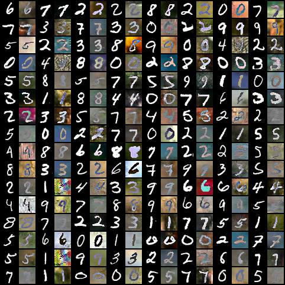
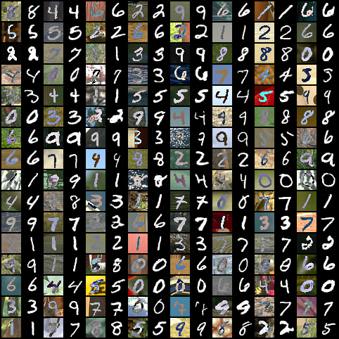

# Pytorch-CycleGAN-Digits
Pytorch implementation of CycleGAN for MNIST, USPS, SVHN, MNIST-M and SyntheticDigits datasets.

 

Change the DB variable to change the dataset.
For using the saved model to generate images, set LOAD_MODEL to True and EPOCHS to 0.
## Generated Samples
MNIST &#8596; MNIST-M
MNIST &#8594; MNIST-M             |  MNIST-M &#8594; MNIST
:-------------------------:|:-------------------------:
  |  
