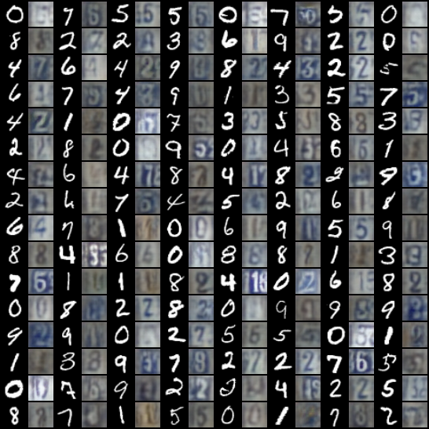
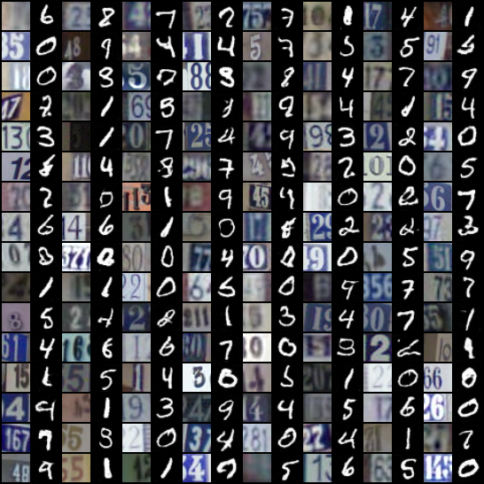
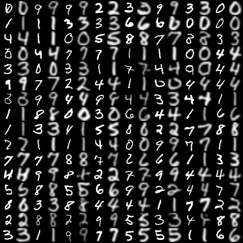
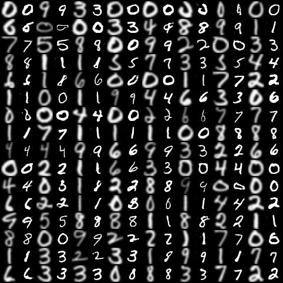
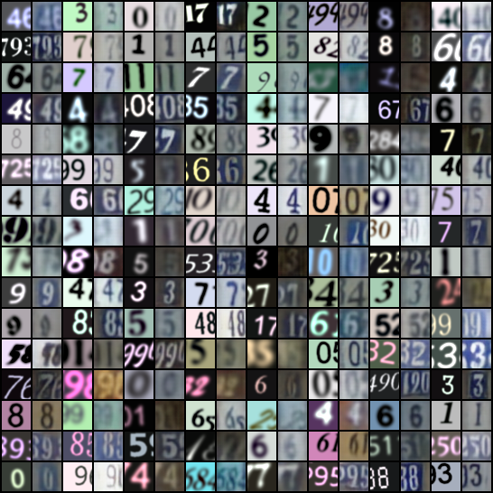
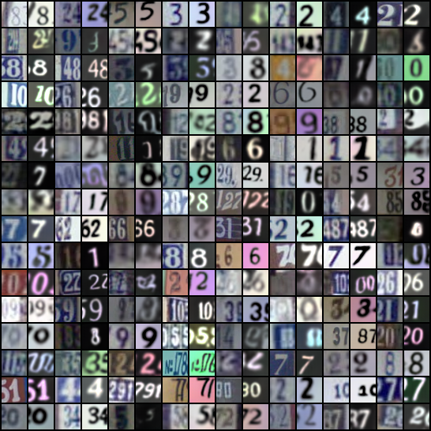

# Pytorch-CycleGAN-Digits
Unofficial Pytorch implementation of [CycleGAN](https://arxiv.org/abs/1703.10593) for MNIST, USPS, SVHN, MNIST-M and SyntheticDigits datasets.

 

Change the DB variable to change the dataset.
For using the saved model to generate images, set LOAD_MODEL to True and EPOCHS to 0.
## Generated Samples
### MNIST &#8596; SVHN
MNIST &#8594; SVHN             |  SVHN &#8594; MNIST
:-------------------------:|:-------------------------:
  |  

### MNIST &#8596; MNIST-M
MNIST &#8594; MNIST-M             |  MNIST-M &#8594; MNIST
:-------------------------:|:-------------------------:
  |  

MNIST &#8594; USPS             |  USPS &#8594; MNIST
:-------------------------:|:-------------------------:
  |  

SyDigits &#8594; SVHN             |  SVHN &#8594; SyDigits
:-------------------------:|:-------------------------:
  |  
